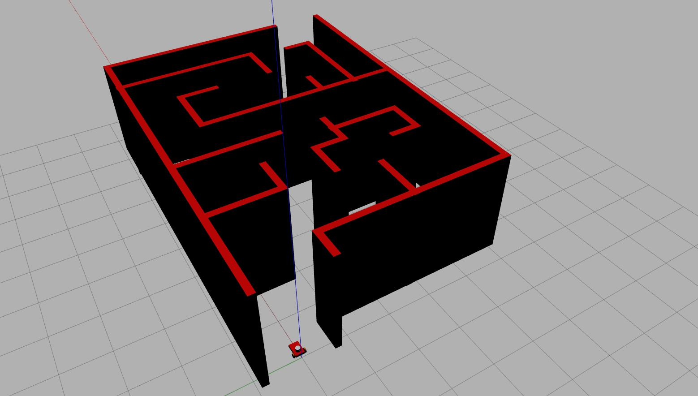

# Ros Projects
"ROS Projects" is a curated repository dedicated to housing a collection of projects centered around Robot Operating System (ROS). This repository serves as a resource hub for individuals seeking projects specifically related to ROS technologies.

# Installation
- [Robot Operating System](http://wiki.ros.org/melodic/Installation/Ubuntu)
- [Robot Operating System 2](https://docs.ros.org/en/foxy/Installation.html)
# Projects
## MazeBot
"Mazebot" is an innovative project implemented in ROS2, showcasing a robot's ability to navigate and solve mazes utilizing computer vision. This project underscores the fusion of ROS2 capabilities with advanced computer vision techniques, enabling the robot to autonomously navigate and successfully navigate through maze environments.

### Project installation and testing 
- Step 1: Copy the mazebot directory in the ROS2 workspace and perform colcon build
- step 2: Run the mazebot_camera_maze.launch.py file 

## Ros Navigation Stack
The ROS Navigation Stack project is a foundational implementation in ROS, offering a fundamental exploration into topics such as gmapping and SLAM. Designed for those embarking on their journey into ROS, this project provides essential insights into the navigation stack, serving as an excellent starting point for enthusiasts looking to delve into the intricacies of ROS navigation.

### Project installation and testing 
- Step 1: Copy the ros navigation stack directory in the ROS workspace and perform catkin_make
- step 2: Run the [navigation.launch](ros navigation stack/navigation/launch/navigation.launch) file

## [Youtube](https://www.youtube.com/playlist?list=PLUnfeehiY56uImWc1iqEyvTOfCGaH3C71)

